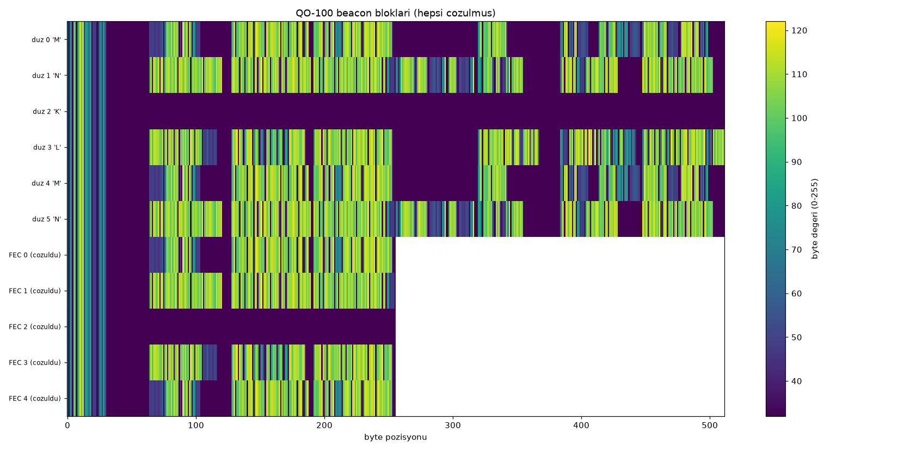
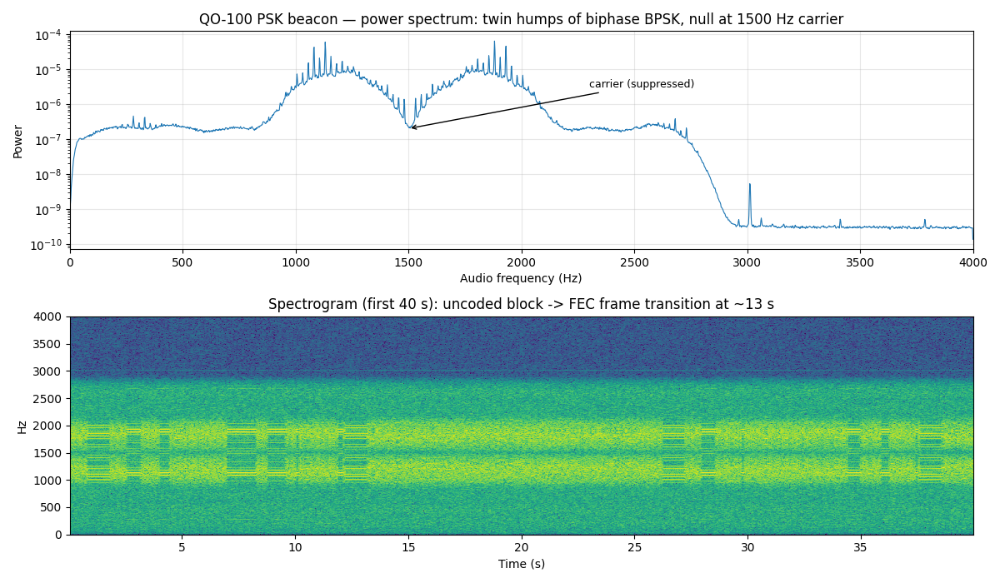

# qo100-beacon-decoder

**[🇬🇧 English](README.md)** | 🇹🇷 Türkçe


**QO-100 uydusunun PSK beacon'ını sıradan bir ses kaydından çözen, saf Python ile
yazılmış, her katmanı öğreten bir decoder.**

Bir WebSDR'den kaydettiğiniz `.wav` dosyasını verirsiniz; script size uydunun
yayınladığı metin bültenlerini, hata-düzeltme (FEC) katmanının içindeki kodlanmış
kopyalarını ve yayının tam zaman çizelgesini döker. GNU Radio gerekmez, özel
donanım gerekmez — sadece `numpy`, `scipy` ve merak.

```
Ses (WAV) ──► BPSK demodülasyon ──► bifaz çözme ──► çerçeve ayrıştırma ──► METİN
                                                └──► FEC çözme (Viterbi+RS) ──► METİN
```

---

## İçindekiler

1. [QO-100 nedir?](#1-qo-100-nedir)
2. [Beacon nedir, ne yayınlar?](#2-beacon-nedir-ne-yayınlar)
3. [Nasıl kullanılır (adım adım)](#3-nasıl-kullanılır)
4. [Çıktılar ne anlama geliyor?](#4-çıktılar)
5. [Sinyal katmanı: 400 bps BPSK ve bifaz kodlama](#5-sinyal-katmanı)
6. [Çerçeve katmanı: AMSAT P3-D formatı](#6-çerçeve-katmanı-p3-d-formatı)
7. [FEC katmanı: AO-40 hata düzeltme zinciri](#7-fec-katmanı-ao-40)
8. [Yayın akışı: bir düz, bir kodlanmış](#8-yayın-akışı)
9. [Dosyalar ve doğrulama](#9-dosyalar-ve-doğrulama)
10. [Kaynaklar](#10-kaynaklar)

---

## 1. QO-100 nedir?

**QO-100 (Qatar-OSCAR 100)**, Es'hail-2 adlı ticari haberleşme uydusunun üzerinde
taşınan amatör radyo transponderidir. 2018'de fırlatıldı ve bir ilki temsil eder:
**dünyanın ilk sabit yörüngeli (geostationary) amatör radyo uydusu.**

Sabit yörünge şu demek: uydu, ekvatorun 35.786 km üzerinde, Dünya'nın dönüş
hızıyla aynı hızda döner — yani gökyüzünde hep aynı noktada durur (25.9° Doğu).
Alçak yörünge uydularının aksine "geçiş saati" beklemezsiniz; anteniniz bir kez
doğru yöne bakarsa uydu 7/24 oradadır. Kapsama alanı Brezilya'dan Tayland'a kadar
uzanır; Türkiye tam ortasındadır.

İki transponderi vardır:

| Transponder | Uplink (gönderme) | Downlink (alma) | Kullanım |
|---|---|---|---|
| Narrow Band (NB) | 2400.050–2400.300 MHz | 10489.550–10489.800 MHz | SSB, CW, FT8, SSTV, **beacon** |
| Wide Band (WB) | 2401.5–2409.5 MHz | 10491–10499 MHz | DATV (dijital TV) |

Bu proje NB transponderin tam ortasındaki **PSK beacon** ile ilgilenir.

## 2. Beacon nedir, ne yayınlar?

Beacon, uydu operatörünün (AMSAT-DL + Qatar ARS, istasyon çağrı işareti DK0SB)
7/24 kesintisiz yayınladığı bir işaret sinyalidir. Görevleri: frekans referansı
sağlamak, kullanıcılara güç seviyesi sınırı göstermek ("gücünüz beacon'ı
aşmasın") ve **duyuru bültenleri** taşımak.

- **Frekans:** 10489.750 MHz (downlink)
- **Modülasyon:** 400 bps BPSK, bifaz (Manchester) kodlu
- **İçerik:** K, L, M, N tipli metin blokları — acil durum frekansı duyurusu,
  band planı, genel duyurular. Her blok bir de FEC-korumalı kopyasıyla yayınlanır
  (bkz. [bölüm 7](#7-fec-katmanı-ao-40)).

Bir waterfall ekranında beacon, 10489.750 merkezli **çift tümsekli** karakteristik
bir iz olarak görünür (çift tümsek, bifaz kodlamanın imzasıdır — bkz. bölüm 5).

## 3. Nasıl kullanılır

### 3.1 Gereksinimler

```bash
pip3 install numpy scipy matplotlib
```

İki dosya aynı klasörde olmalı: `qo100_beacon_decoder.py` (ana script) ve
`ao40_fec.py` (FEC çözme modülü).

### 3.2 Kayıt alma (WebSDR ile — anten gerekmez!)

Kendi anteniniz yoksa internete açık bir WebSDR alıcısı kullanabilirsiniz.
Test ettiğimiz alıcı: **<http://websdr.is0grb.it:8901/>** (IS0GRB, Sardinya).

Siteye girin ve şu ayarları yapın:

| Ayar | Değer | Neden |
|---|---|---|
| Frequency | **10489748.50 kHz** | Beacon (10489.750) ses bandında tam 1500 Hz'e düşer |
| Mode | **USB2.7** | Tek yan bant; 2.75 kHz filtre sinyalin tamamını geçirir |
| DSP Noise Reduction | **Disabled** | Gürültü azaltma faz bilgisini bozar; BPSK faza dayanır |
| Autonotch | **Kapalı** | Beacon'ı "parazit taşıyıcı" sanıp söndürür |
| Squelch / Mute / High Boost | **Kapalı** | Sinyali kesmesin / şekillendirmesin |
| Audio AGC | Auto | Sorunsuz |
| Volume | Yüksek (kırpılmadan) | Kayıt sinyal/gürültü oranı için |

Doğru yapılandırmanın ekran görüntüsü: [`misc/settings.png`](misc/settings.png)

Waterfall'da beacon'ın çift tümsekli izinin sarı filtre şeklinin **içinde**
olduğunu doğrulayın. Sonra:

1. Sayfadaki **"Audio recording: start"** düğmesine basın
2. **En az 60–90 saniye** bekleyin (bir düz blok 10.4 s, bir FEC frame 13 s
   sürer; tam bir döngü yakalamak için süre gerekir — 3 dakika idealdir)
3. **stop** → **download** ile `.wav` dosyasını indirin

### 3.3 Çalıştırma

```bash
python3 qo100_beacon_decoder.py kayit.wav
```

Hepsi bu. Script sırasıyla taşıyıcıyı bulur, demodüle eder, çerçeveleri ayrıştırır,
FEC'i çözer ve dökümü hem ekrana basar hem `data/` klasörüne yazar.

### 3.4 Örnek çıktı

```
tasiyici: 1506.14 Hz
chip sayisi: 120921, goz kalitesi: 4.73 (>2 iyi)

6 duz blok (6 CRC OK), 5 FEC frame (5 cozuldu)

==============================================================================
KAYIT DOKUMU - kronolojik  (t = kayit basindan saniye, 400 bps, kayit 151.1s)
==============================================================================
 #    t_bas    t_son  tur  tip  boyut  UTC   dogrulama
------------------------------------------------------------------------------
 0     1.8s    12.2s  DUZ  M     512B  N/A   CRC OK
 1    13.2s    26.2s  FEC  M     256B  N/A   RS OK (0 duzeltme)  <- onceki M blogunun ilk yarisi (birebir ayni)
 2    27.2s    37.6s  DUZ  N     512B  N/A   CRC OK
 ...
10   128.8s   139.2s  DUZ  N     512B  N/A   CRC OK
    [!] t=139.2s-151.1s arasi (12.0s) okunamadi - yarim/bozuk blok ya da kayit siniri
```

Gerçek, tam bir döküm için: [`data/sample_00_dokum.txt`](data/sample_00_dokum.txt)

Ve blokların içeriği:

```
==============================================================================
[2] t=27.2s  DUZ  tip='N'  UTC: N/A  CRC OK
------------------------------------------------------------------------------
  N HI de Qatar-OSCAR 100 (DK0SB)
  In order to coordinate potential emergency communications
  during the actual or any other crisis, the following frequency
  will be assigned as international emergency frequency on QO-100
  NB Transponder: Downlink: 10489.860 MHz  Uplink: 2400.360 MHz
  ...
```

## 4. Çıktılar

Her koşu, girdi dosyasının adıyla `data/` altına iki dosya üretir
(sayaç sayesinde eski çıktıların üzerine yazılmaz):

| Dosya | İçerik |
|---|---|
| `data/<ad>_00_dokum.txt` | Ekrandaki kronolojik dökümün aynısı |
| `data/<ad>_00_block.png` | Isı haritası: her satır bir blok, renk = byte değeri (0–255). Sabit alanlar dikey şerit olarak görünür |

Isı haritası örneği (gerçek kayıttan — üstte 6 düz metin bloğu şeritli desenleriyle,
altta çözülmüş FEC blokları):



Konsoldaki iki sağlık göstergesi:

- **göz kalitesi** (eye quality): demodülatör çıkışının netliği. >2 iyi,
  >4 mükemmel. Düşükse sinyal zayıf ya da ayarlar yanlış demektir.
- **CRC OK / RS OK**: çözülen verinin matematiksel olarak hatasız olduğunun kanıtı.

## 5. Sinyal katmanı

### BPSK nedir?

Dijital veriyi bir radyo taşıyıcısına bindirmenin en yalın yollarından biri:
**B**inary **P**hase **S**hift **K**eying. Taşıyıcı dalganın *fazı* bit değerine
göre 180° döndürülür: faz aynı kaldıysa bir sembol, ters döndüyse diğeri.
Alıcı tarafında iş, bu faz sıçramalarını yakalamaktır.

### Bifaz (Manchester) kodlama nedir, neden var?

Beacon bitleri doğrudan değil, **bifaz** kodlayarak gönderir: her veri biti
iki "chip"e açılır ve bilgi, chip'in kendisinde değil **geçişlerde** taşınır.
400 bps veri → 800 chip/s hat hızı.

Nedeni pratik: uzun süre hiç değişmeyen bit dizisi (örn. 50 tane 0x50 dolgu
baytı) düz BPSK'da uzun süre sabit faz demektir — alıcının saat senkronu kayar.
Bifaz her bit süresinde en az bir geçiş garantiler; alıcı saatini her an tazeler.
Yan etkisi spektrumda görülür: enerji taşıyıcının iki yanında **iki tümsek**
halinde toplanır, tam merkezde çukur oluşur. (Waterfall'daki çift çizginin sırrı.)

Gerçek kayıttan spektrum — çift tümsek ve 1500 Hz'deki bastırılmış taşıyıcı
açıkça görünüyor:



### Bu projedeki demodülasyon zinciri

```
WAV ─► Hilbert dönüşümü (gerçek sinyal → kompleks/analitik sinyal)
    ─► kaba taşıyıcı tahmini (1000–2500 Hz bandının spektral ağırlık merkezi)
    ─► ince ayar: sinyalin karesi alınır → BPSK'nın 180° sıçramaları yok olur,
       2×taşıyıcı frekansında tek temiz ton kalır (klasik "squaring loop")
    ─► faz takibi (kare sinyalin fazının yarısı ile döndürme)
    ─► 800 chip/s örnekleme (en iyi örnekleme anı enerji maksimizasyonuyla)
    ─► bifaz çözme: chip çiftleri XOR'lanır → 400 bps bit dizisi
```

## 6. Çerçeve katmanı: P3-D formatı

Bitleri elde ettik; peki hangi bit nerede başlıyor? Burada devreye **AMSAT
P3-D telemetri formatı** girer (AO-10/13/40 uydularından miras, resmi spec
[tlmspec.txt](https://amsat-dl.org/wp-content/uploads/2019/01/tlmspec.txt)).

Her çerçevenin yapısı:

```
┌──────────────────┬────────────────┬───────────────┬─────────┐
│ ~130 byte 0x50   │ SYNC (4 byte)  │ VERİ          │ CRC     │
│ 'P' dolgusu      │ 39 15 ED 30    │ 512 byte      │ 2 byte  │
└──────────────────┴────────────────┴───────────────┴─────────┘
```

- **Dolgu (0x50 = ASCII 'P'):** çerçeveler arası boşluk. Ham dökümde
  `PPPPPP...` dizileri olarak görünür.
- **Sync kelimesi:** alıcının "çerçeve burada başlıyor" dediği sabit 32 bit.
  Decoder bunu bit düzeyinde korelasyonla arar — byte hizası gerekmez.
- **CRC:** AMSAT "CYC2" polinomu `x¹⁶+x¹²+x⁵+1` (CRC-CCITT ailesi), başlangıç
  değeri 0xFFFF, MSB-first. Güzel özellik: doğru CRC'yi *içeren* 514 byte
  üzerinden CRC hesaplarsanız sonuç 0 çıkar — doğrulama tek satırdır.
- **Blok tipi = verinin ilk byte'ı:**

| Tip | Anlamı |
|---|---|
| `A` | Telemetri: başlıkta UTC tarih/saat + 128 analog + 128 dijital kanal |
| `E` | Geçmiş olay kayıtları (A formatında) |
| `K` `L` `M` `N` | Mesaj blokları — serbest metin bültenleri (QO-100'ün yayınladığı bunlar) |
| `D` | Dosya transferi paketi |
| `X` | Yazılım yükleme bloğu |

> Not: QO-100 beacon'ı şu an yalnızca K/L/M/N mesaj blokları yayınlıyor; A tipi
> telemetri göndermiyor. Decoder yine de hazırlıklı: bir A bloğu gelirse
> başlığındaki UTC alanını otomatik ayrıştırır. Gelmediği sürece dökümde
> `UTC: N/A` görürsünüz.

## 7. FEC katmanı: AO-40

### FEC nedir, neden var?

**FEC = Forward Error Correction (İleri Yönde Hata Düzeltme).** Radyo kanalı
gürültülüdür; bitler bozulur. İki strateji vardır: hatayı *fark edip* yeniden
istemek (internette TCP böyle yapar) ya da veriye önceden öyle bir matematiksel
fazlalık eklemek ki alıcı hatayı **kendi kendine düzeltebilsin**. Uyduda geri
kanal lüksü yoktur — beacon kimseye "tekrar gönder" diyemez. Bu yüzden FEC.

### AO-40 nedir?

AO-40 (AMSAT-OSCAR 40, 2000–2004), zamanının en iddialı amatör uydusuydu.
Telemetrisi için Phil Karn (KA9Q), NASA'nın derin uzay araçlarında kullandığı
CCSDS kodlama mimarisini amatör dünyaya uyarladı. Uydu öleli 20 yıl oldu ama
bu FEC tasarımı yaşıyor: QO-100 beacon'ı ve FUNcube uyduları (AO-73, JY1SAT,
Nayif-1) bugün hâlâ aynı formatı kullanır.

### Kodlama zinciri (verici tarafında)

256 byte'lık metin şu beş aşamadan geçerek 5200 bite şişer (~2.5×):

```
256 byte metin
  │ 1. İkiye böl: 2 × 128 byte
  ▼
Reed-Solomon RS(160,128): her yarıya 32 byte parite eklenir → 2 × 160 = 320 byte
  │    GF(2⁸), alan polinomu 0x187, fcr=112, prim=11 (CCSDS ailesi)
  │    Kazanç: codeword başına 16 byte'a kadar hatayı DÜZELTEBİLİR
  ▼
Scrambler (CCSDS randomizer, x⁸+x⁷+x⁵+x³+1, tohum 0xFF)
  │    Veriyi istatistiksel gürültüye çevirir → uzun 0/1 koşuları engellenir
  ▼
Convolutional kod (K=7, oran 1/2, CCSDS polinomları, 2. çıkış ters)
  │    Her bit 2 bite: komşu bitler birbirine matematiksel olarak bağlanır
  │    Alıcıda Viterbi algoritması en olası orijinal diziyi geri bulur
  ▼
Interleaver: 5200 bit, 80 sütun × 65 satırlık matrise satır-satır yazılır,
  │    sütun-sütun okunur → art arda gelen "burst" hatalar dağıtılır,
  │    RS'in düzeltebileceği tekil hatalara dönüşür
  ▼
Distributed sync: 65 bitlik senkron deseni her 80. bit pozisyonuna serpiştirilir
  │    (tek parça sync burst hatayla ölür; dağıtılmış sync ölmez)
  ▼
5200 bit = 400 bps'de 13.0 saniye yayın
```

Decoder (`ao40_fec.py`) bu zinciri tersinden yürütür:
**distributed sync arama → deinterleave → Viterbi → descramble → RS düzeltme.**

Sayıların özeti:

| Parametre | Değer |
|---|---|
| FEC frame uzunluğu | 5200 bit (13.0 s) |
| Sync deseni | 65 bit, her 80. pozisyonda dağıtık |
| Interleaver | 80 sütun × 65 satır |
| Convolutional kod | K=7, r=1/2, 2. çıkış ters (CCSDS) |
| Reed-Solomon | RS(160,128) × 2 interleaved, GF(2⁸) 0x187, fcr=112, prim=11 |
| Net taşınan veri | 256 byte = 4 satır × 64 karakter metin |

## 8. Yayın akışı

Beacon iki formatı sürekli dönüşümlü yayınlar:

```
zaman ──────────────────────────────────────────────────────────────►
[DÜZ M 10.4s] [FEC M 13s] [DÜZ N 10.4s] [FEC N 13s] [DÜZ K] [FEC K] ...
   512 kar.     256 kar.
   CRC'li       Viterbi+RS korumalı
```

Her FEC frame, **hemen önündeki düz bloğun ilk 256 karakterinin korumalı
kopyasıdır** — decoder bunu byte-byte karşılaştırıp dökümde raporlar
(`<- onceki M blogunun ilk yarisi (birebir ayni)`). Neden çift yayın? Güçlü
istasyonlar düz bloğu kolayca okur; zayıf/küçük antenli istasyonlar ise FEC
kopyayı hatasız çözebilir. Aynı içerik, iki farklı güvenlik seviyesi.

## 9. Dosyalar ve doğrulama

| Dosya | Görev |
|---|---|
| `qo100_beacon_decoder.py` | DSP ön ucu + P3-D çerçeve ayrıştırıcı + raporlama |
| `ao40_fec.py` | AO-40 FEC çözme zinciri (sync/deinterleave/Viterbi/descramble/RS) |
| `data/` | Çıktılar (döküm + ısı haritası), girdi adı + koşu sayacıyla |

FEC zincirinin her aşaması, **gr-satellites projesinin resmi test vektörleriyle**
(gerçek bir AO-73/FUNcube paketi) bit-bit doğrulanmıştır: sync bulma ✓,
deinterleave ✓, Viterbi çıkışı referansla birebir ✓, RS çözümü referans
çerçeveyle birebir ✓.

Uygulama, gr-satellites (Daniel Estévez, GPL-3.0) ve libfec (Phil Karn, KA9Q)
referans alınarak saf Python/NumPy olarak yeniden yazılmıştır; bu nedenle repo
lisansı GPL-3.0'dır.

## 10. Kaynaklar

- AMSAT P3-D Telemetri Spesifikasyonu (Release 1.8, 2001):
  <https://amsat-dl.org/wp-content/uploads/2019/01/tlmspec.txt>
- G3RUH — Oscar-40 FEC Telemetry (FEC tasarımının anlatımı):
  <https://amsat.org/articles/g3ruh/125.html>
- Phil Karn KA9Q — A Proposal for a Coded AO-40 Telemetry Format:
  <http://www.ka9q.net/papers/ao40tlm.html>
- Daniel Estévez — QO-100 beacon çözümlemeleri:
  <https://destevez.net/2019/02/decoding-the-qo-100-beacon-with-gr-satellites/>
  <https://destevez.net/2019/04/qo-100-beacon-fec-decoder/>
- gr-satellites (referans implementasyon ve test vektörleri):
  <https://github.com/daniestevez/gr-satellites>
- AMSAT-DL QO-100 sayfaları: <https://amsat-dl.org/en/>
- Test edilen WebSDR (IS0GRB): <http://websdr.is0grb.it:8901/>
